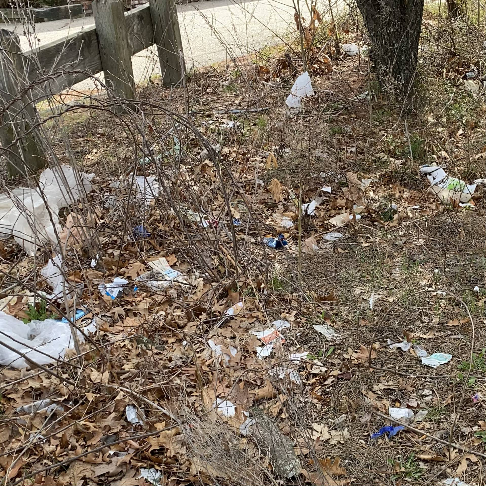
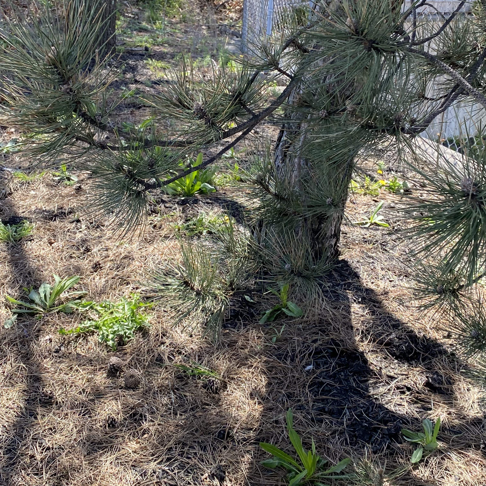
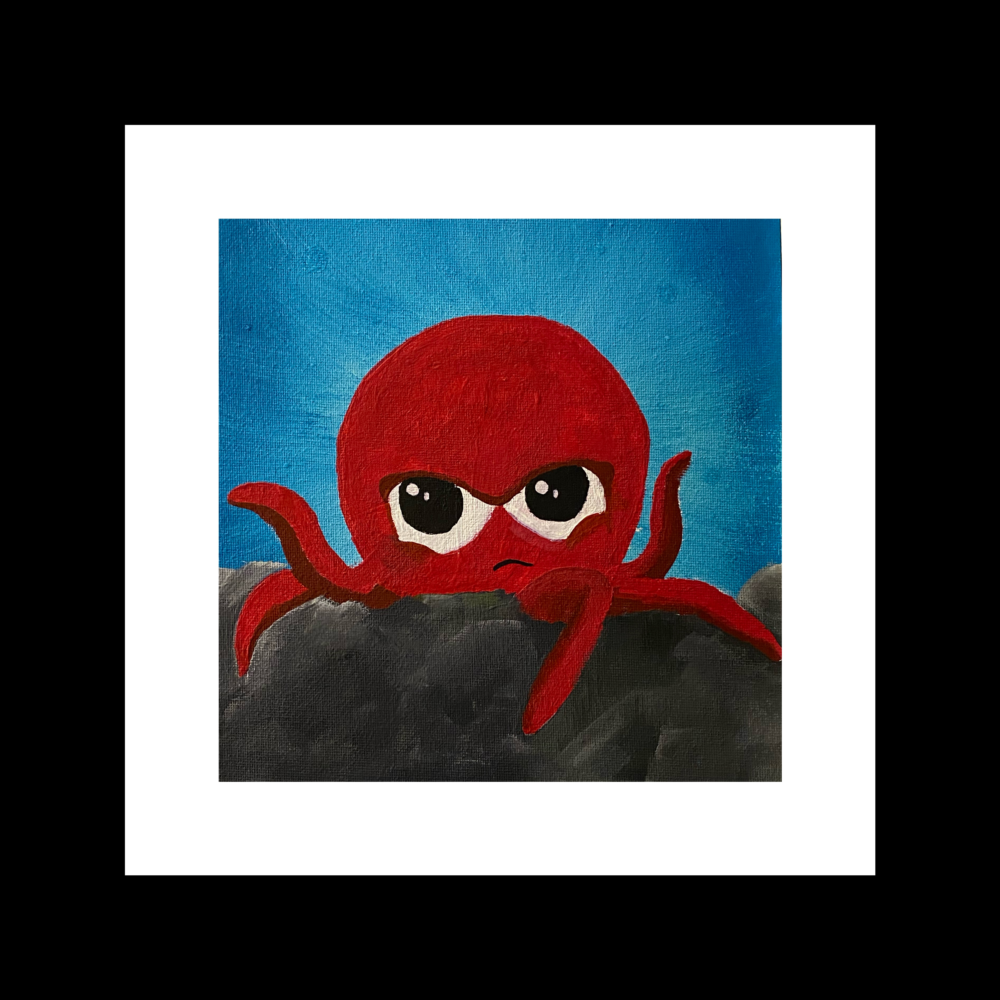
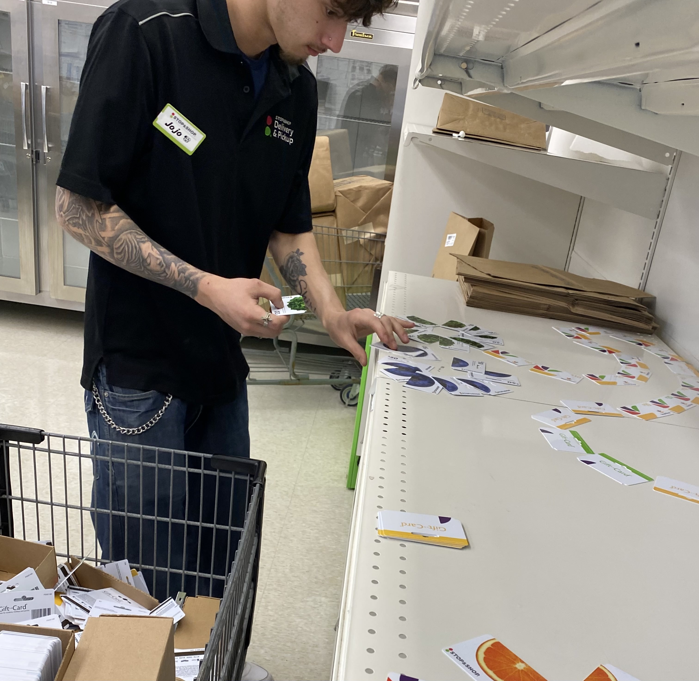
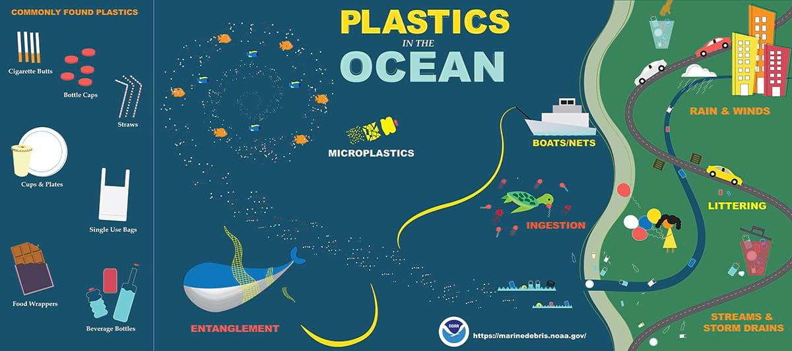
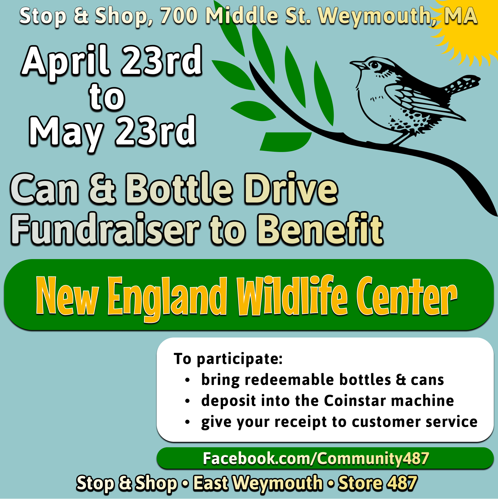
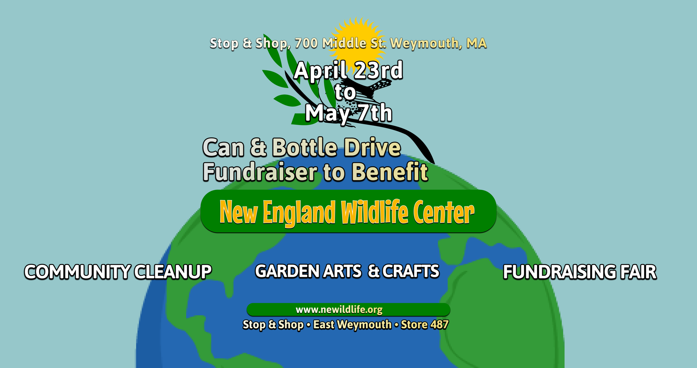

https://www.nytimes.com/2022/04/03/science/ocean-plastic-animals.html?smid=url-share

[A Guide to Plastic in the Ocean - It’s a problem, but it’s one we can do something about](https://oceanservice.noaa.gov/hazards/marinedebris/plastics-in-the-ocean.html)

[Community487 Facebook Page](https://www.facebook.com/community487)

[Docusaurus blogging features](https://docusaurus.io/docs/blog) are powered by the [blog plugin](https://docusaurus.io/docs/api/plugins/@docusaurus/plugin-content-blog).

Simply add Markdown files (or folders) to the `blog` directory.

Regular blog authors can be added to `authors.yml`.

The blog post date can be extracted from filenames, such as:

- `2019-05-30-welcome.md`
- `2019-05-30-welcome/index.md`

A blog post folder can be convenient to co-locate blog post images:

The blog supports tags as well!

https://www.facebook.com/donate/943274183037158/
