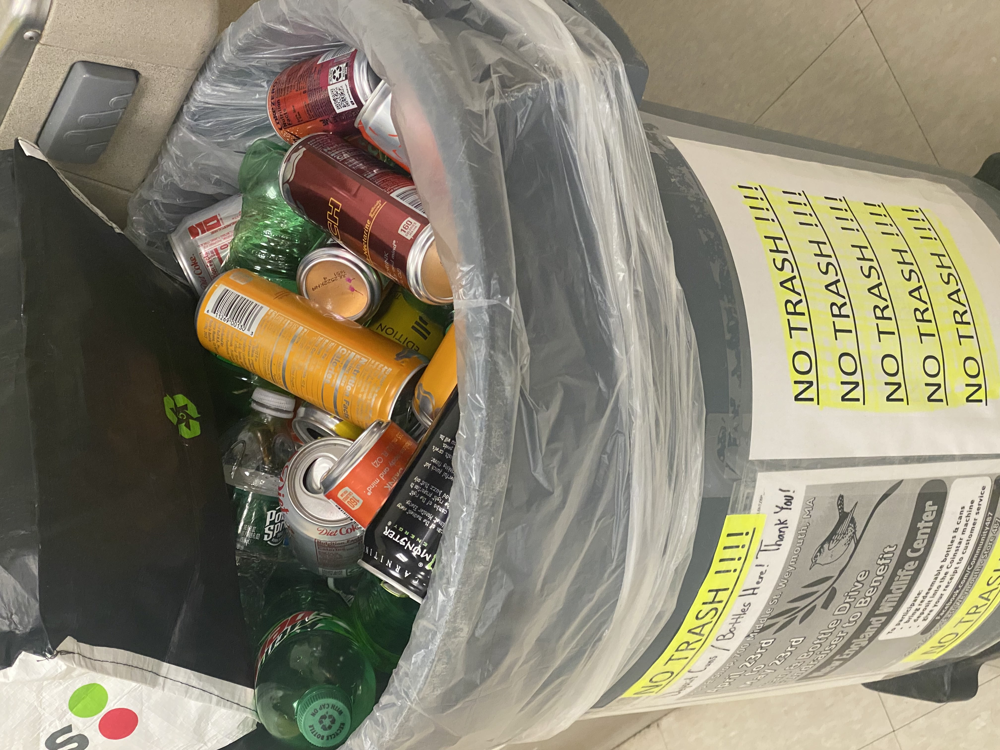
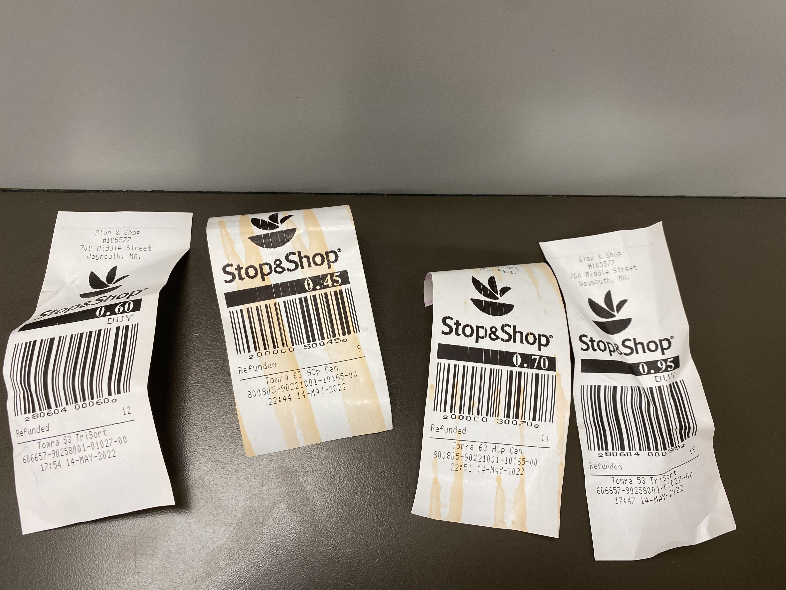
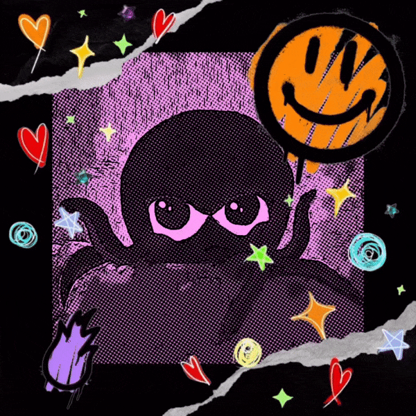

## The Origin of Earth Day ##
Earth Day started as a response to a huge oil spill. It got the attention of a lot of people from all walks of life. The first Earth Day was a coordinated effort that included protests across the country. The result of the people coming together for the sake of the environment resulted in the formation of the EPA, or Environmental Protection Agency. 

### One Major Problem We Face Today is Plastic ###  
The ocean is filling up with plastic. The issue with this fact is that [animals get caught in the plastic](https://www.nytimes.com/2022/04/03/science/ocean-plastic-animals.html?smid=url-share) **and the plastics get broken down into microplastics**. 

 

<b>Image Credit - Octopus Illustration by Jess</b>

> Even if we don't throw trash directly into the ocean, it makes it's way there through a variety of sources. As shown in the graphic below, plastic that we use and don't recycle makes its way into the ocean when we litter. The rain and wind then migrate commonly found plastics -  **single use bags, drink bottles, food wrappers and more** - into the oceans through the streams and storm drains. 

Source: [A Guide to Plastic in the Ocean - It’s a problem, but it’s one we can do something about](https://oceanservice.noaa.gov/hazards/marinedebris/plastics-in-the-ocean.html)

### Earth Day 2022 Community Cleanup Day ###

> The litter shown in the image above consists of mostly **single use bags, food wrappers, drink bottles, and cigarette packaging**.

> It doesn't take much to clean up an area that's littered with trash. The photo above is the after of the same area that was littered with trash. To honor **Earth Day** and in conjunction with **Weymouth's Community Cleanup Day**, our community service group, **Community 487**, pitched in to make a difference. 

## But that was just the beginning of a change in mindset and workplace culture ## 

> We started a **can and bottle drive to encourage our co-workers to recycle their plastic bottles instead of throwing them in the trash**. 

The proceeds from the recycling effort will benefit the [New England Wildlife Center](https://www.newildlife.org/). 

#### We're looking at CREATIVE WAYS TO REUSE PLASTIC that would otherwise have gotten thrown away ####

> For example, one of our bright **Community 487** members, **Jojo**, learned that our store was planning on throwing away boxes and boxes of old giftcards, he had the vision to save them and use them to create art. 

### We'd love for you to get involved ###
> We're looking for ways to engage the community in  artistic and creative ways to encourage sustainability. If you are a local artist or arts organization that would like to get involved with helping to create works of art with unrecyclable plastics, [click here to get in touch with us through our Facebook page, Community 487](https://www.facebook.com/community487). 

> You can also [click here to donate and help us raise money for the New England Wildlife Center through our fundraising link on Facebook](https://www.facebook.com/donate/943274183037158/)

